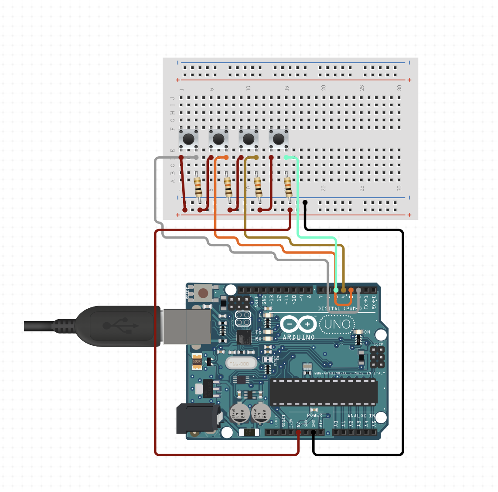

# Pongduino

This is multiplayer Pong that can be controlled with an Arduino. I wanted to learn C++ and thought this would be a good project to do that with.

## Features

- Multiplayer with both game instances communicating via a gameserver. The server and client communication uses UDP.
- Built with Raylib library
- Can be played with a keyboard or an Arduino controller.

## Instructions to run

- Make sure you have [Raylib](https://github.com/raysan5/raylib) installed on your system
- Clone the code
- `mkdir build && cd build && cmake .. && make` (Run this from the base `Pongduino` directory)
- In `build` you should now have the following executables, `pong-p1`, `pong-p2` and `pong-server`
- Start up the server in a new terminal with `./pong-server`

### Playing with an keyboard

- In a new terminal run `./pong-p1 k 1` (Start pong with player one using a keyboard)
- In another new terminal run `./pong-p2 k 2` (Start pong with player two using a keyboard)

### Playing with an Arduino

- Make sure the Arduino is plugged in. The `start.sh` script will automatically find the Arduino and pass it in to pong as an argument. **NOTE** This is currently only working with Mac. If you want to use Linux, just overwrite `$ardfd` in the script. I've not got access to a Windows machine so I've no idea how to set this up on there.
- In a new terminal run `start.sh 1` (Start pong with player one using the arduino)
- In another new terminal run `start.sh 2` (Start pong with player two using the arduino)

- You'll now have two instances of the game running communicating via the server

## Arduino setup

The arduino is setup so both players use it, sort of old school arcade vibes. Set it up as per the image. Flash the `controller/arduino/controller.ino` code onto your Arduino. I'm using an Uno and I usually use the Arduino IDE to flash code to it.
The diagram below shows the wiring. The ports are a little different though so check the `controller.ino` code for which inputs to use.

## Thoughts

- I'd love to update the CMake file to download and configure the Raylib so you don't need to do this manually
- The latency and responsiveness of the Arduino code is a bit laggy. I'd love to spend some more time optimising this code.
- I'd love to not have to run both game instances on the same machine, maybe over LAN, to get a better experience. But this has really been a learning exercise in C++, reading data from the serial port, writing networking code and more.
- If you stumble upon this repo and have experience with C++, I'd love any/all feedback on the code! Thanks
